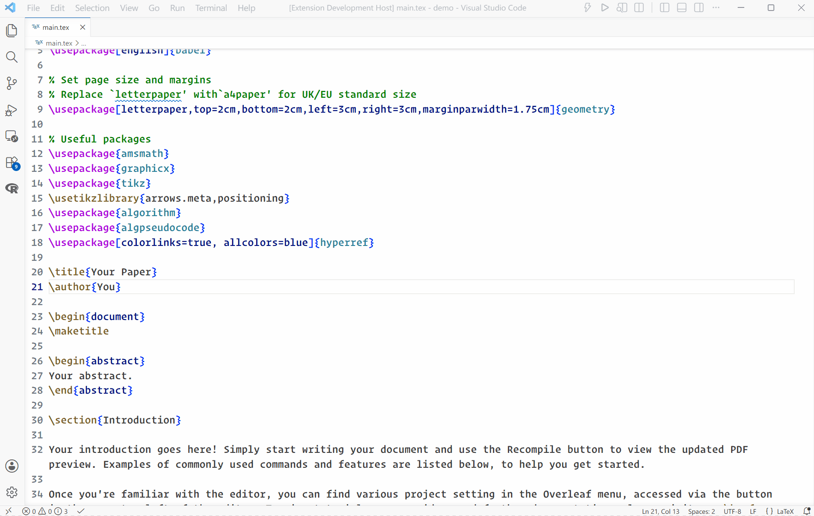
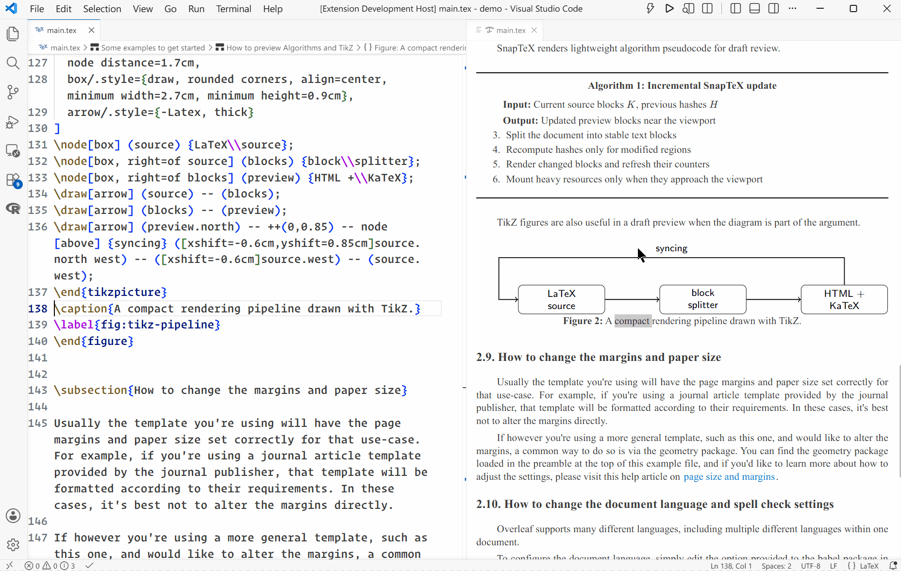
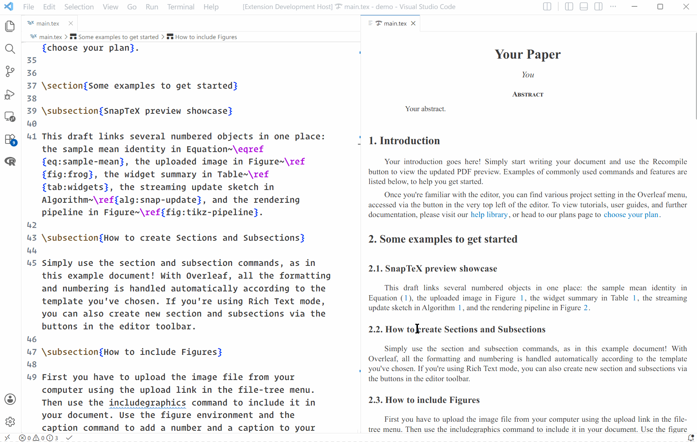
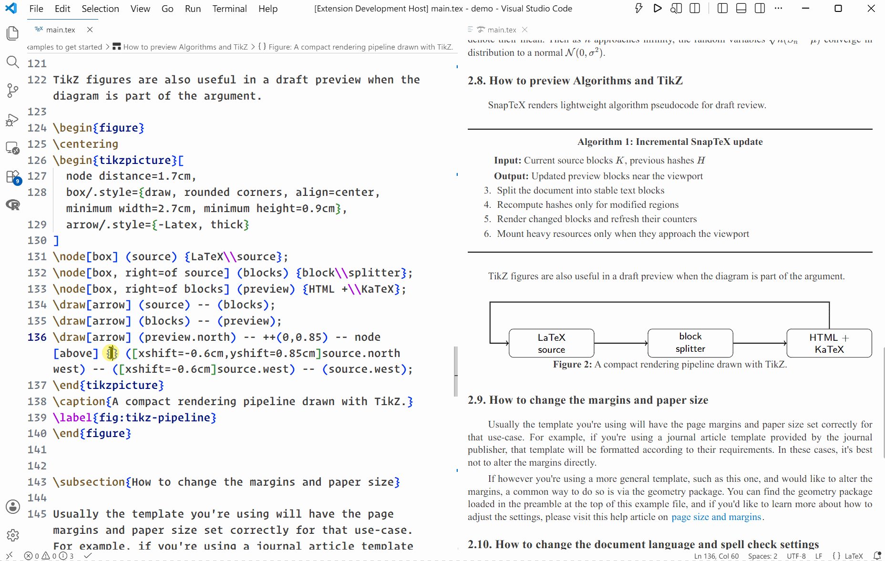

# SnapTeX

Fast, local-first LaTeX editing and structural preview for VS Code and the browser.

**[Open SnapTeX Web](https://qianchd.github.io/SnapTeX/)** · **[Read the documentation](https://qianchd.github.io/SnapTeX/docs/)** · **[Install the VS Code extension](https://marketplace.visualstudio.com/items?itemName=qstatsite.snaptex)**

> **What's new in 0.8.0:** SnapTeX now opens in an elastic paged preview by default, with stable virtualized scrolling, flexible page bottoms, and extended pages for oversized content. Continuous preview remains available in settings.

<p align="center">
  
</p>

SnapTeX renders prose, math, references, citations, figures, PDFs, tables, algorithms, theorem-like environments, and TikZ without requiring a local TeX distribution. It is designed for responsive writing and navigation; use a full TeX toolchain for final pagination and publication output.

## Demo

<p align="center">
  
</p>

| Bidirectional sync | Automatic scroll sync |
| --- | --- |
|  |  |

| Rich structural preview | Fast local updates |
| --- | --- |
|  |  |

## Choose a Host

| Host | Best for | Storage |
| --- | --- | --- |
| VS Code extension | Native local editing and workspace integration | Local VS Code workspace |
| Static Web/PWA | Browser editing, offline use, and portable workspaces | Local folder handles or IndexedDB |
| SnapTeX Server | Named projects stored on infrastructure you control | Authenticated server project directory |

The public Web app performs document processing locally and does not upload local-folder or browser-workspace contents. Remote projects are available only in a separately deployed server edition.

## Quick Start

### VS Code

1. Install **SnapTeX** from the [VS Code Marketplace](https://marketplace.visualstudio.com/items?itemName=qstatsite.snaptex).
2. Open the root `.tex` file.
3. Press `Ctrl+K V` (`Cmd+K V` on macOS).

Use `Ctrl+Alt+M` (`Cmd+Alt+M`) to reveal the editor cursor in the preview. Double-click preview content to return to its source.

### Web

Open [SnapTeX Web](https://qianchd.github.io/SnapTeX/) and choose **Open Folder**, **Import Folder**, or **Open Demo**. **History** reopens recent browser workspaces and supported local folders; imported projects and the demo persist in browser storage and can be exported as ZIP.

## Highlights

- KaTeX math, PDF.js figures, and bundled TikZJax rendering.
- Block hashes, incremental patches, and dependency-aware refreshes.
- Default virtual mode for lower DOM and heavy-resource memory use on long documents.
- Bidirectional navigation, automatic scroll sync, references, and contextual tooltips.
- External BibTeX and inline `thebibliography` previews.
- Structured metadata for titles, authors, affiliations, email addresses, abstracts, and keywords.
- Shared rendering core across VS Code, standalone Web, PWA, and server hosts.
- Extensible render, metadata, dependency, AST, and splitter rules assembled in [`src/rules.ts`](src/rules.ts).

See [Rendering Support](https://qianchd.github.io/SnapTeX/docs/features/rendering) for details and intentional compatibility boundaries.

## Development

```bash
npm ci
npm run compile
npm test
```

Web and documentation commands:

```bash
npm run web:serve-static   # static Web app + docs
npm run docs:dev           # documentation development server
npm run web:build-server   # server-enabled Web assets
```

The maintained guides cover:

- [Web projects and browser storage](https://qianchd.github.io/SnapTeX/docs/guide/web)
- [Static Web and PWA deployment](https://qianchd.github.io/SnapTeX/docs/deployment/static-web)
- [SnapTeX Server installation](https://qianchd.github.io/SnapTeX/docs/deployment/server)
- [Security model](https://qianchd.github.io/SnapTeX/docs/deployment/security)
- [Developer extension guide](https://qianchd.github.io/SnapTeX/docs/extending/)
- [Rendering rule API](https://qianchd.github.io/SnapTeX/docs/extending/rule-api)
- [Architecture and rendering pipeline](https://qianchd.github.io/SnapTeX/docs/development/architecture)

## Core Dependencies

- [Markdown-it](https://github.com/markdown-it/markdown-it) for prose rendering.
- [KaTeX](https://katex.org/) for math.
- [PDF.js](https://mozilla.github.io/pdf.js/) for PDF figures.
- [TikZJax](https://github.com/kisonecat/tikzjax) and the [Glenn Rice fork](https://github.com/drgrice1/tikzjax) for TikZ.
- [unified-latex](https://github.com/siefkenj/unified-latex) for the experimental AST backend.

SnapTeX is licensed under [GPL-3.0-or-later](LICENSE).
