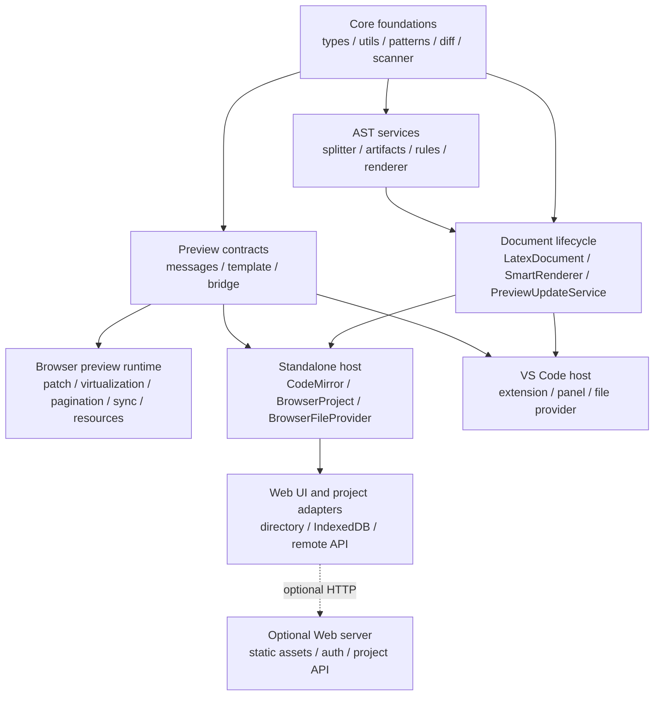

# Architecture

SnapTeX separates project/editor integration, host-neutral document processing, and browser preview display. Read the diagram from top to bottom: hosts provide source and settings, the core returns serializable updates, and the preview runtime owns visible DOM.

```text
apps/vscode ───────────────────┐
                              ├─> PreviewUpdateService
apps/web -> apps/standalone ───┘      │
                                      ├─> LatexDocument
                                      ├─> scanner / diff
                                      └─> SmartRenderer
                                              │
                                              v
                                      serializable RenderPayload
                                              │
                                              v
                                  shared browser preview runtime
                                  DOM / virtual shells / PDF / TikZ
```

Data crosses these boundaries through interfaces and serializable payloads. The core never reaches into an editor UI, and the preview runtime never reads project files directly.

## Request flow

1. A host implements `IFileProvider`, selects a root URI, and calls `PreviewUpdateService` with source and settings.
2. The service updates `LatexDocument` and `SmartRenderer` using one `RuleRegistry` snapshot.
3. The renderer returns a full or patch `RenderPayload`.
4. The host sends that payload through the shared preview message protocol.
5. The preview runtime mounts or patches DOM and sends sync, tooltip, resource, and lazy-block requests back to the host.

This flow is the same in VS Code and Web. Their differences are file access, editor events, settings UI, and transport adapters.

## Entry points

| Runtime | Start reading at | Delegates to |
| --- | --- | --- |
| VS Code extension activation | `apps/vscode/src/extension.ts` | Commands and `PreviewPanel` |
| VS Code preview host | `apps/vscode/src/panel.ts` | `PreviewUpdateService` and webview messages |
| Web application | `apps/web/src/main.ts` | Standalone app plus browser project adapters |
| Standalone editor/preview services | `apps/standalone/src/app.ts` | Core service and project operations |
| Optional remote-project server | `apps/web/server.mjs` | Authenticated project API and static assets |
| Host-neutral preview lifecycle | `src/preview-update-service.ts` | `LatexDocument` and `SmartRenderer` |
| Browser preview runtime | `src/webview/main.ts` | DOM patching, virtualization, resources, and sync |

Start at the entry point for the observed behavior, then follow calls toward the owner in the state table below.

## State ownership

| State | Long-lived owner | Crosses a boundary as |
| --- | --- | --- |
| Project files and writable operations | Host file provider/project backend | URI, text, binary resource, or operation result |
| Root source, included files, metadata, block spans, compact source-map segments | `LatexDocument` | Document state read by renderer/service |
| Block render snapshots, dependencies, citation state | `SmartRenderer` | `RenderPayload` and lazy block results |
| Active editor file, selection, dirty state | VS Code or standalone host | Sync/update requests |
| Mounted HTML and measured heights | Preview runtime | Sync/resource messages and diagnostics |

No layer should keep a second authoritative copy of state owned elsewhere. Cached hashes, HTML, and shell heights are derived state with explicit invalidation or lifetime rules.

## Core: `src/`

The core has no direct VS Code UI ownership. Its main responsibilities are:

- parse preamble metadata and project dependencies;
- split the source into block spans;
- scan counters, labels, and citations;
- diff block hashes and dependency fingerprints;
- render requested blocks;
- define host/preview message contracts;
- generate the shared preview HTML template.

`LatexDocument` owns source text, spans, hashes, metadata, diagnostics, compact source-map segments, and AST artifacts. `SmartRenderer` owns render rules, protected HTML, cached block snapshots, citation numbering, and patch/full render payloads.

The source map is an internal compact representation rather than an extension API. Consecutive flattened lines from the same source file are stored as one segment. Public document methods translate between original and flattened lines, so callers should use those methods instead of depending on segment storage.

`PreviewUpdateService` is the host-facing coordinator. Hosts should call it instead of separately driving document parsing and rendering, and tests should use it when verifying complete update behavior.

## Standalone host: `apps/standalone/`

The standalone layer connects the core to a browser editor without committing to a particular storage backend. It owns:

- CodeMirror setup and LaTeX assistance;
- preview host orchestration;
- browser-compatible URI and file-provider primitives;
- generic project operations and project-tree helpers;
- ZIP export.

Web and a future Android wrapper can reuse this layer.

## Web host: `apps/web/`

The Web app owns browser UI and browser/server storage adapters:

- split panes, Explorer, menus, settings, welcome page, and dialogs;
- local directory handles;
- IndexedDB workspaces and demo import;
- remote project API client;
- static/PWA build;
- authenticated Node project server and deployment scripts.

These concerns do not belong in the core because they depend on browser APIs, DOM controls, HTTP, or Linux deployment.

## VS Code host: `apps/vscode/`

The extension adapter owns activation, commands, settings, editor events, workspace file access, webview creation, and VS Code reveal behavior. It passes the shared core URI-like values and message payloads rather than exposing VS Code APIs to the renderer.

## Shared preview runtime: `src/webview/` and `media/`

The preview runtime runs in both VS Code webviews and the standalone Web app. A host bridge abstracts `postMessage`. The runtime owns patches, virtualization, scroll/sync UI, tooltips, PDF canvases, and TikZ scheduling.

## Stable boundaries

The main contracts are:

- `IFileProvider` for project reads;
- `RuleRegistry` for rendering extensions;
- `RenderPayload` for full and patch updates;
- `HostToPreviewMessage` / `PreviewToHostMessage` for runtime communication;
- `BrowserProject` for Web storage backends.

`BrowserProject` owns storage capabilities rather than UI. Writable adapters provide file operations; adapters backed by an independently editable source may additionally provide `watchTextFiles`. `StandaloneHost` consumes those changes using its saved text as the three-way merge base, while the remote Web adapter maps HTTP manifest revisions and ETags onto that host-neutral contract.

New hosts should implement these boundaries instead of importing another host's UI layer.

## Dependency direction



Solid arrows are production import directions. The dashed Web-to-server edge
is an optional runtime API call; the static Web build does not import the Node
server.

- `src/` must not import VS Code or Web UI modules.
- `apps/standalone/` may use browser/editor primitives but must not assume one Web storage backend.
- `apps/web/` may depend on standalone services and browser/server adapters.
- `apps/vscode/` adapts VS Code directly and does not route through the Web UI.
- `src/webview/` and `media/` are shared by both hosts and communicate only through the preview bridge/protocol.

When a change would reverse one of these arrows, move the reusable behavior toward the shared boundary and keep platform calls in the adapter.

## Static dependency audit

The current production import graph is acyclic. AST modules depend on the
foundation layer, while only the lifecycle composition modules import AST
services; AST code does not import `LatexDocument`, `SmartRenderer`, or a host.
Likewise, the shared preview runtime imports protocol contracts but never the
document or renderer objects that created a payload.

The highest fan-in modules are deliberate foundations:

| Module | Why many modules depend on it | Review rule |
| --- | --- | --- |
| `src/utils.ts` | Shared text, URI, HTML, scheduling, and balanced LaTeX readers | Reuse an existing helper before adding another parser or host utility |
| `src/types.ts` | Serializable document, rendering, sync, and registry contracts | Keep host objects and DOM nodes out of these types |
| `src/ast/rules/index.ts` | AST rule contract and shared argument/render helpers | Keep concrete built-in rules in their rule modules |
| `src/ast/visit-utils.ts` | Structural AST predicates and traversal | Add only parser-shape operations that several AST consumers share |

Large fan-out composition files such as `src/renderer.ts`, `src/document.ts`,
and `src/ast/rules/defaults.ts` are expected to know many lower-level services.
That is not a reason to move their orchestration into those dependencies.

## Next

- Follow the data through [Rendering Pipeline](./rendering-pipeline.md).
- For source-level LaTeX support, choose an entry point in the [Extension Model](../extending/index.md).
- For a host-specific problem, return to the entry-point table and trace only that host's adapter.
