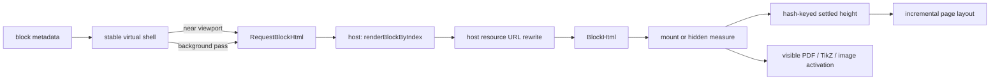

# Rendering Pipeline

The pipeline turns one root document plus project files into a serializable preview update. This page follows data ownership; use [Architecture](./architecture.md) first when deciding which directory should contain a change.

| Stage | Owner | Input | Output |
| --- | --- | --- | --- |
| Project read | Host `IFileProvider` | Root URI and relative paths | Source and resource data |
| Document parse | `LatexDocument` | Root source, registry, backend mode | Metadata, included body, block spans, hashes, maps, diagnostics |
| Ordered scan | `LatexCounterScanner` | Block text and prior summaries | Counters, labels, citations, per-block summaries |
| Diff and render | `SmartRenderer` | Document state and prior snapshot | Full or patch `RenderPayload` |
| Host transport | VS Code or standalone host | Render payload and lazy-resource requests | Typed preview messages |
| Browser display | Shared preview runtime | Full/patch messages | Mounted HTML, virtual shells, PDF canvases, TikZ SVGs |

`PreviewUpdateService` coordinates the document and renderer stages so hosts and end-to-end tests do not have to reproduce their ordering.

## Core lifecycle objects

| Object | Created/owned by | Retains |
| --- | --- | --- |
| `RuleRegistry` | `src/rules.ts`, passed into the service | Active metadata, rendering, dependency, and splitter declarations |
| `LatexDocument` | `PreviewUpdateService` | Root source, included-file map, metadata, block spans/hashes, diagnostics, compact source-map segments, source hints |
| `SmartRenderer` | `PreviewUpdateService` | Render snapshots, dependencies, citations, and full/patch state |
| `RenderPayload` | `SmartRenderer` | Serializable update sent to a preview host |
| Preview block shell | Browser runtime | Stable layout identity and estimated/measured height |

The host should not separately drive document parsing and rendering. The preview runtime should not reconstruct document state from HTML.

## Initial load

1. A host supplies the root URI, source text, and file provider.
2. `LatexDocument.parse()` extracts preamble metadata and expands supported included source.
3. The selected backend creates coarse block spans and hashes.
4. The scanner computes numbering, labels, citations, and block summaries.
5. Dependency rules attach compact dependency fingerprints.
6. `SmartRenderer` emits block metadata and initial HTML according to virtual mode.
7. The preview runtime creates shells and mounts nearby blocks.
8. A bounded background pass requests remaining HTML serially, refines heights and page boundaries, and releases hidden resource output after measurement.

The initial payload may intentionally omit far-away block HTML. That is a completed virtualized load, not a partial document parse: source spans, hashes, source maps, and shell metadata already exist. Blocks without jump targets omit the optional `anchors` array instead of serializing an empty array.



The resource marker syntax is shared, but resolution remains host-specific.
VS Code maps a project path to a webview URI; standalone maps it to a browser
resource or object URL. Both use the same decode-and-escape step before HTML is
sent to the preview runtime.

## Derived preview state

The preview deliberately has three related height representations. They are
not interchangeable caches:

| Representation | Owner | Lifetime and purpose |
| --- | --- | --- |
| Shell height by block hash | `BlockVirtualizationController` | Survives mount/unmount and reuses geometry for unchanged blocks |
| Current element height | `PageLayoutController` | Tracks the live DOM element used by the current page layout |
| Pinned viewport anchor | `ViewportAnchorController` | Temporary visual compensation while a layout mutation is applied |

The controller in `src/webview/main.ts` coordinates these owners. It should not
store another authoritative height table or reimplement their invalidation.

## Incremental update

```text
source edit
    -> update spans and metadata
    -> compare block hashes
    -> collect changed and dependency-dirty blocks
    -> reuse or update block scan summaries
    -> render requested dirty blocks
    -> send patch or full payload
    -> update mounted DOM and virtual shells
```

Unchanged block text is not duplicated into long-lived renderer snapshots. Hashes determine source equality; dependency fingerprints catch blocks whose own source is unchanged but whose external metadata changed. Empty per-block metadata is omitted, and AST label/citation arrays are reused as immutable artifact data rather than copied into a second snapshot representation.

A **dependency-dirty block** is therefore an unchanged source block whose rendered inputs changed. For example, editing `\title{...}` can rerender a separate `\maketitle` block, and changing cited keys can rerender a bibliography block.

Use these distinctions while debugging:

| Symptom | Inspect first |
| --- | --- |
| Wrong block boundary or source line | `LatexDocument` splitter/source map output |
| Correct block marked unchanged after external metadata changed | Dependency descriptors/fingerprint |
| Correct dirty block produces wrong HTML | Selected backend's render rule/helper |
| Correct payload does not appear or scrolls incorrectly | Preview message handling/DOM runtime |

## Rendering rules

Legacy preprocessing rules run in ascending priority, protecting generated HTML before Markdown-it. In AST mode, the AST walker tests `astRenderRules` in array order and gives the first rule returning a result ownership of the current node. Unclaimed AST nodes use the AST fallback renderer; built-in AST rules reuse shared math, citation, table, TikZ, and inline helpers where the output contract is common.

The selected backend runs one rendering-rule array. A source-level extension targets `renderRules` or `astRenderRules`; it is not automatically passed through both.

## Full versus patch update

Patches preserve unchanged DOM, PDF canvases, and TikZ SVGs. A full update is reserved for initial load, structural resets such as backend switching, and sufficiently broad changes under the renderer's established threshold.

## Heavy resources

The initial payload does not eagerly compile every TikZ picture or draw every PDF page. Visible output is activated when the owning block mounts. Paged background measurement may compile TikZ to obtain its cropped bounds or read a PDF page viewport without drawing pixels; that hidden output is released immediately. Stale work is rejected by generation-aware scheduling, while the previous successful visible TikZ SVG stays in place until its replacement succeeds.

## Continue by subsystem

| If the change concerns | Continue with |
| --- | --- |
| AST refinement, artifacts, or AST rule ownership | [AST Backend](./ast-backend.md) |
| Cursor, click, scroll, or virtual-target navigation | [Sync Model](./sync-model.md) |
| Memory, startup, diffing, or virtual layout | [Performance](./performance.md) |
| A new LaTeX command or environment | [Extension Model](../extending/index.md) |
| Verification level and fixtures | [Testing](./testing.md) |
