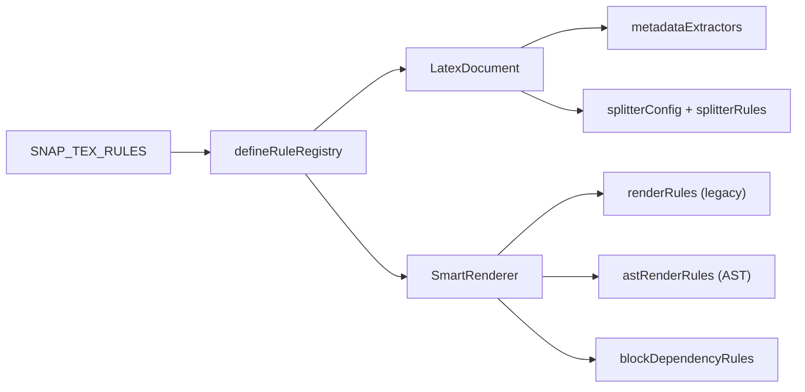
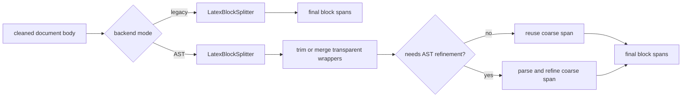
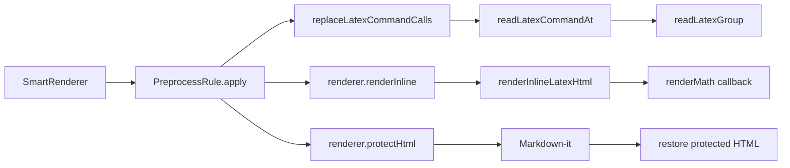
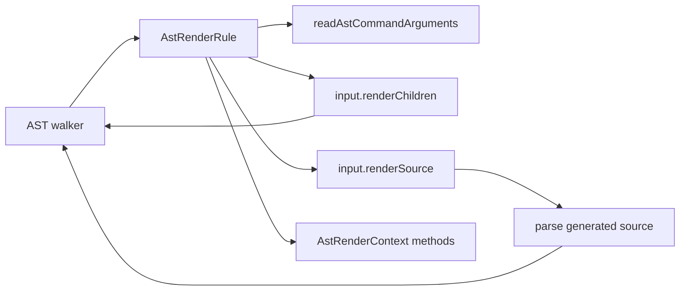
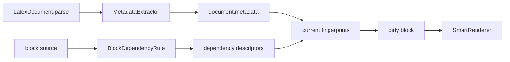
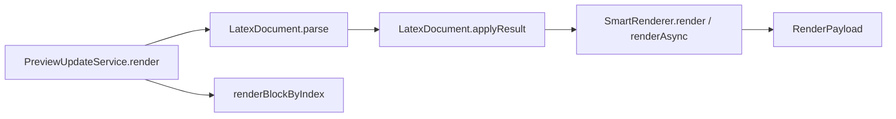

# API Call Relationships

<!--@include: ../../.vitepress/partials/api-context.md-->

This page shows when each extension API runs and which lower-level functions it normally calls. The arrows describe runtime calls, not import direction.

## Runtime values at a glance

These names appear repeatedly in rule examples, but they are created at different layers:

| Value | Created by | Available inside | Primary role |
| --- | --- | --- | --- |
| `text` | Legacy block renderer | `PreprocessRule.apply` | Current transformed block source |
| `renderer` | `SmartRenderer` | `PreprocessRule.apply` | Legacy document state and protected-output services |
| `input` | AST walker | `AstRenderRule` | Current node, siblings, and recursive rendering |
| `context` | AST renderer | `AstRenderRule` | AST document state and direct-HTML services |
| `call` | `replaceLatexCommandCalls` | Its nested `render` callback | One balanced source command call |
| `deps` | Dependency collector host | `BlockDependencyRule` | Factories for stable dependency descriptors |

Your rule never constructs these objects. It declares callbacks; the owning service creates the values and invokes the callbacks.

## Registry to rendering



`defineRuleRegistry` copies the registry collections and sorts only legacy rules by `priority`. `LatexDocument` consumes metadata and splitter definitions; `SmartRenderer` consumes rendering and dependency rules.

A declaration helper and the registry have different jobs:

```text
defineAstRenderRule(rule)       -> type-check and return one declaration
defineBlockDependencyRule(rule) -> type-check and return one declaration
defineRuleRegistry({...})        -> assemble the declarations used by a preview lifecycle
```

## Splitter flow



AST mode shares the mature coarse splitter rather than replacing it. On later
edits, coarse hashes let the document reuse unchanged refined spans and run AST
refinement only for the changed coarse range. See the
[Splitter Contract](./contracts/splitter) for the rule-kind ownership matrix.

## Legacy rule flow



Legacy rules receive source text in priority order. Generated HTML must be protected before Markdown conversion. Balanced readers are optional helpers, but they are the preferred way to read command arguments.

The nested `render(call)` callback belongs to `replaceLatexCommandCalls`; it is invoked only for a syntactically valid command. Its returned string replaces that command inside the block passed to the next legacy rule.

## AST rule flow



The first AST rule that returns a result claims the node; `undefined` passes it to the next rule. `renderChildren` reuses existing child nodes. `renderSource` parses generated source and is intended for macro expansion or reconstructed LaTeX, not ordinary child traversal.

`AstRenderRule` returns final HTML. `consumedNodes` controls how far the walker advances; it is not an HTML property and does not represent child count.

## Metadata and dependencies



Dependency collection identifies *what* a block depends on. SnapTeX stores the descriptors for unchanged blocks and recomputes their fingerprints from current document state, avoiding repeated source scans.

## End-to-end testing



Use `PreviewUpdateService` when a test needs to verify the behavior a host actually receives, including parsing, block diffing, numbering, dependencies, and backend selection.

## Related contracts

- [Registry contract](./contracts/registry)
- [Legacy rule contract](./contracts/legacy-rules)
- [AST rule contract](./contracts/ast-rules)
- [Metadata and dependency contract](./contracts/metadata-dependencies)
- [Splitter contract](./contracts/splitter)
