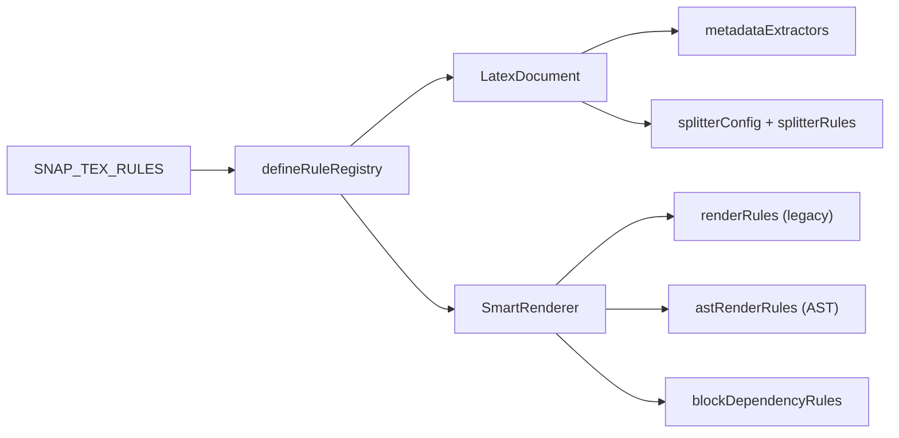
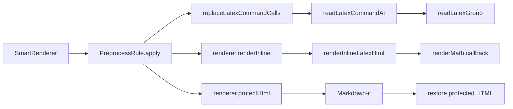
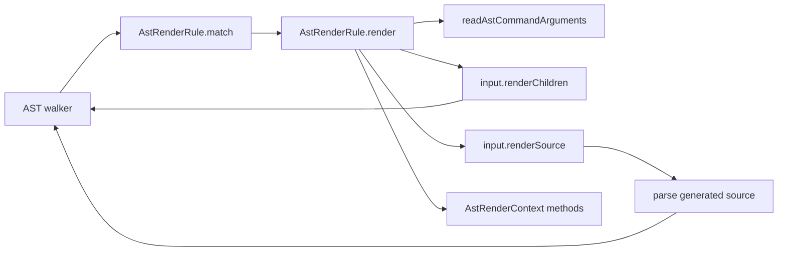
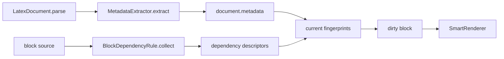
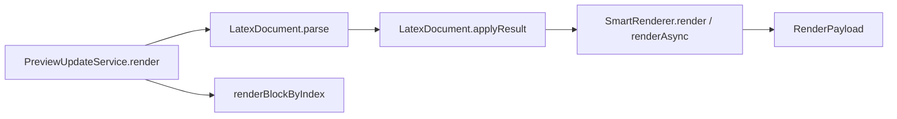

# API Call Relationships

This page shows when each extension API runs and which lower-level functions it normally calls. The arrows describe runtime calls, not import direction.

## Registry to rendering

`defineRuleRegistry` copies the registry collections and sorts only legacy rules by `priority`. `LatexDocument` consumes metadata and splitter definitions; `SmartRenderer` consumes rendering and dependency rules.

## Legacy rule flow

Legacy rules receive source text in priority order. Generated HTML must be protected before Markdown conversion. Balanced readers are optional helpers, but they are the preferred way to read command arguments.

## AST rule flow

The first AST rule that matches and returns a result claims the node. `renderChildren` reuses existing child nodes. `renderSource` parses generated source and is intended for macro expansion or reconstructed LaTeX, not ordinary child traversal.

## Metadata and dependencies

Dependency collection identifies *what* a block depends on. SnapTeX stores the descriptors for unchanged blocks and recomputes their fingerprints from current document state, avoiding repeated source scans.

## End-to-end testing

Use `PreviewUpdateService` when a test needs to verify the behavior a host actually receives, including parsing, block diffing, numbering, dependencies, and backend selection.

## Related contracts

- [Registry contract](./contracts/registry)
- [Legacy rule contract](./contracts/legacy-rules)
- [AST rule contract](./contracts/ast-rules)
- [Metadata and dependency contract](./contracts/metadata-dependencies)
- [Splitter contract](./contracts/splitter)
